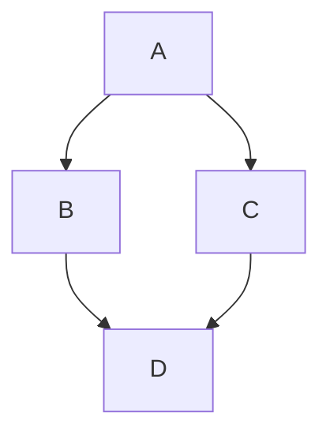

## GitHub Markdown Render

## Markdown Basic Syntax

I just love **bold text**. Italicized text is the _cat's meow_. At the command prompt, type `nano`. [`nano`](https://github.com/bytedance/bytemd)

My favorite markdown editor is [ByteMD](https://github.com/bytedance/bytemd).

1. First item
2. Second item
3. Third item

> Dorothy followed her through many of the beautiful rooms in her castle.

```js
import { Editor, Viewer } from 'bytemd'
import gfm from 'bytemd-plugin-gfm'

const plugins = [
  gfm(),
  // Add more plugins here
]

const editor = new Editor({
  target: document.body, // DOM to render
  props: {
    value: '',
    plugins,
  },
})

editor.on('change', e => {
  editor.$set({ value: e.detail.value })
})
```

Save the document by pressing <kbd>Ctrl</kbd> + <kbd>S</kbd>

## GFM Extended Syntax

Automatic URL Linking: https://github.com/bytedance/bytemd

~~The world is flat.~~ We now know that the world is round.

- [x] Write the press release
- [ ] Update the website
- [ ] Contact the media

| Syntax    | Description |
| --------- | ----------- |
| Header    | Title       |
| Paragraph | Text        |

> [!NOTE]
> Useful information that users should know, even when skimming content.

> [!TIP]
> Helpful advice for doing things better or more easily.

> [!IMPORTANT]
> Key information users need to know to achieve their goal.

> [!WARNING]
> Urgent info that needs immediate user attention to avoid problems.

> [!CAUTION]
> Advises about risks or negative outcomes of certain actions.

## Footnotes

Here's a simple footnote,[^1] and here's a longer one.[^bignote]

[^1]: This is the first footnote.

[^bignote]: Here's one with multiple paragraphs and code.

    Indent paragraphs to include them in the footnote.

    `{ my code }`

    Add as many paragraphs as you like.

## Gemoji

Thumbs up: :+1:, thumbs down: :-1:.

Families: :family_man_man_boy_boy:

Long flags: :wales:, :scotland:, :england:.

## Math Equation

Inline math equation: $a+b$

$$
\displaystyle \left( \sum_{k=1}^n a_k b_k \right)^2 \leq \left( \sum_{k=1}^n a_k^2 \right) \left( \sum_{k=1}^n b_k^2 \right)
$$

## Mermaid Diagrams



> Text that is a quote1

> [!NOTE]
> Useful information that users should know, even when skimming content.

> [!TIP]
> Helpful advice for doing things better or more easily.

> [!IMPORTANT]
> Key information users need to know to achieve their goal.

> [!WARNING]
> Urgent info that needs immediate user attention to avoid problems.

> [!CAUTION]
> Advises about risks or negative outcomes of certain actions.

## References

- [highlight.js/github.css](https://github.com/highlightjs/highlight.js/blob/main/src/styles/github.css)
- [github-syntax-light/github-light.css](https://github.com/primer/github-syntax-light/blob/master/lib/github-light.css)
- [Code Block Highlight](https://github.com/tofrankie/blog-test/issues/10)

## Demo

### TypeScript

```ts
type Func<T extends any[], R> = (...a: T) => R

/**
 * Composes single-argument functions from right to left. The rightmost
 * function can take multiple arguments as it provides the signature for the
 * resulting composite function.
 *
 * @param funcs The functions to compose.
 * @returns A function obtained by composing the argument functions from right
 *   to left. For example, `compose(f, g, h)` is identical to doing
 *   `(...args) => f(g(h(...args)))`.
 */
export default function compose(): <R>(a: R) => R

export default function compose<F extends Function>(f: F): F

/* two functions */
export default function compose<A, T extends any[], R>(f1: (a: A) => R, f2: Func<T, A>): Func<T, R>

/* three functions */
export default function compose<A, B, T extends any[], R>(
  f1: (b: B) => R,
  f2: (a: A) => B,
  f3: Func<T, A>
): Func<T, R>

/* four functions */
export default function compose<A, B, C, T extends any[], R>(
  f1: (c: C) => R,
  f2: (b: B) => C,
  f3: (a: A) => B,
  f4: Func<T, A>
): Func<T, R>

/* rest */
export default function compose<R>(f1: (a: any) => R, ...funcs: Function[]): (...args: any[]) => R

export default function compose<R>(...funcs: Function[]): (...args: any[]) => R

export default function compose(...funcs: Function[]) {
  if (funcs.length === 0) {
    // infer the argument type so it is usable in inference down the line
    return <T>(arg: T) => arg
  }

  if (funcs.length === 1) {
    return funcs[0]
  }

  return funcs.reduce(
    (a, b) =>
      (...args: any) =>
        a(b(...args))
  )
}
```

### Javascript

```js
// @ts-ignore
import * as builtIns from 'builtInLanguages'
import HighlightJS from './highlight.js'

const hljs = HighlightJS

for (const key of Object.keys(builtIns)) {
  // our builtInLanguages Rollup plugin has to use `_` to allow identifiers to be
  // compatible with `export` naming conventions, so we need to convert the
  // identifiers back into the more typical dash style that we use for language
  // naming via the API
  const languageName = key.replace('grmr_', '').replace('_', '-')
  hljs.registerLanguage(languageName, builtIns[key])
}
// console.log(hljs.listLanguages());

export default hljs
```

```js
import { Editor, Viewer } from 'bytemd'
import gfm from 'bytemd-plugin-gfm'

const plugins = [
  gfm(),
  // Add more plugins here
]

const editor = new Editor({
  target: document.body, // DOM to render
  props: {
    value: '',
    plugins,
  },
})

editor.on('change', e => {
  editor.$set({ value: e.detail.value })
})
```

### JSON

```json
{
  "name": "redux",
  "version": "5.0.0-rc.1",
  "main": "dist/cjs/redux.cjs",
  "module": "dist/redux.legacy-esm.js",
  "types": "dist/redux.d.ts",
  "scripts": {
    "clean": "rimraf dist",
    "format": "prettier --write \"{src,test}/**/*.{js,ts}\" \"**/*.md\"",
    "format:check": "prettier --list-different \"{src,test}/**/*.{js,ts}\" \"**/*.md\"",
    "lint": "eslint --ext js,ts src test"
  },
  "devDependencies": {
    "@babel/core": "^7.19.0",
    "@types/node": "^18.7.16",
    "@typescript-eslint/eslint-plugin": "^6",
    "@typescript-eslint/parser": "^6",
    "netlify-plugin-cache": "^1.0.3",
    "prettier": "^2.7.1",
    "rimraf": "^3.0.2",
    "rxjs": "^7.5.6",
    "tsup": "7.0.0",
    "typescript": "5.2",
    "vitest": "^0.34.0"
  },
  "sideEffects": false
}
```

### JSONC

```jsonc
{
  "compilerOptions": {
    "strict": true,
    "target": "ESNext",
    "module": "ESNext",
    "moduleResolution": "Node",
    "baseUrl": "./",
    "types": ["vitest/globals", "esbuild-extra/global"],
    "paths": {
      "redux": ["src/index.ts"], // @remap-prod-remove-line
      "@internal/*": ["src/*"],
    },
  },
  "include": ["src/**/*"],
  "exclude": ["node_modules", "dist"],
}
```

### Bash

```bash
# Basic Installation
$ sh -c "$(curl -fsSL https://raw.githubusercontent.com/ohmyzsh/ohmyzsh/master/tools/install.sh)"
```

### CSS

```css
.app {
  position: relative;
  display: flex;
  flex-direction: column;
  width: 100vw;
  height: 100vh;
  font-size: 0;
}
```

### Java

```java
public class Main {
  public static void main(String[] args) {
    System.out.println("Hello World");
  }
}
```

### Python

```py
class Animal:

    # attribute and method of the parent class
    name = ""

    def eat(self):
        print("I can eat")

# inherit from Animal
class Dog(Animal):

    # new method in subclass
    def display(self):
        # access name attribute of superclass using self
        print("My name is ", self.name)

# create an object of the subclass
labrador = Dog()

# access superclass attribute and method
labrador.name = "Rohu"
labrador.eat()

# call subclass method
labrador.display()
```
